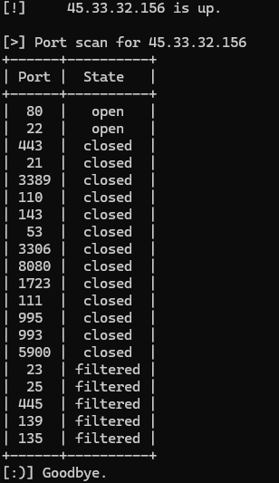

# Network Scanner


Network Scanner is a network discovery command-line application developed with Python (using Scapy library).

It enables host, ports and services discovery, inspired by the workings of Nmap.

## Installation
- _python3_ may have to be used instead of _python_, depending on your configuration.
### 1. Clone the repo
```
git clone https://github.com/todorescu-diana/network-scanner
```
```
cd network-scanner
```

### 2. Create and activate Python virtual environment
```
python -m venv venv
```

### 3. Activate virtual environment
* Windows
```
venv\Scripts\activate.bat
```
* Linux
```
source venv/bin/activate
```

### 4. Install required dependencies
```
pip install -r requirements.txt
```

## Usage
* Windows (may have to be run as admin)
```
python ./scanner.py <options>
```

* Linux
```
sudo ./venv/bin/python ./scanner.py <options>
```

* Displaying options:
```
python ./scanner.py --help
```
```
Usage: scanner.py [OPTIONS]

Options:
  --target TEXT                   IP address or IP range 
                                  to scan; Valid formats:
                                  <IP address> OR <IP 
                                  address>/<prefix length>
                                  OR <hostname> OR <hostname>/<prefix length>
                                  OR <ip_as_octet_ranges>
  --h_retry INTEGER               Number of times to retry to send host
                                  discovery probe. DEFAULT: 1
  --h_timeout INTEGER             Time in seconds to wait for response to host
                                  discovery probe being sent. DEFAULT: 1
  --h_skip / --no-h_skip          Skip host discovery. Treat all hosts as
                                  online and do port scan. DEFAULT: --no-
                                  h_skip
  --traceroute / --no-traceroute  Perform traceroute to
                                  show hop path to
                                  target host(s). DEFAULT:
                                  --no-traceroute
  --proto TEXT                    Protocol to use for port
                                  scanning; Options:
                                  tcp-syn / tcp-connect /
                                  tcp-fin / tcp-null /
                                  tcp-xmas; DEFAULT: tcp-syn
  --ports TEXT                    Port(s) or range of ports
                                  to scan. Valid
                                  formats: <port_no> OR
                                  <port_no1>,<port_no2>,
                                  ...,<port_non> OR
                                  <port_no1>-<port_no2> OR
                                  <port_no1>-<port_no
                                  2>,<port_no3>,
                                  <port_no4>-<port_no5>;
                                  DEFAULT: 20 most common TCP ports
  --mode TEXT                     Mode of operation;
                                  Options: only-log /
                                  log- live / live;
                                  DEFAULT: live
  --show_only_up / --no_show_only_up Only show hosts that are up;
                                  DEFAULT: --no_show_only_up
  --verbose / --no-verbose        Increase verbosity;
                                  DEFAULT: --no-verbose
  --reason / --no-reason          Show reason for result;
                                  DEFAULT: --no-reason
  --help                          Show this message and exit.
```

### TARGET SPECIFICATION

* --target option
```
<IP address>
```
Scans the target at the given IP address.
```
<IP address>/<prefix length>
```
Scans targets in the given CIDR address range.
```
<hostname>
```
Scans the target at the given hostname.
```
<hostname>/<prefix length>
```
Scans targets in the given CIDR address range.
```
<ip_as_octet_ranges>: example - 10.0.0-1.1-2 scans 10.0.0.1, 10.0.0.2, 10.0.1.1, 10.0.1.2
```
Scans targets obtained using specified octet ranges.

### HOST DISCOVERY
#### * Given target host / network is in LAN:
**ARP Ping** used for host dicovery.
#### * Given target host / network is not in LAN:
**ICMP Echo Request Ping** used for host dicovery.

* --h_retry option

Number of times to retry to send host discovery probe. Useful for networks with weak signal, networks with issues that cause dropped packets, or flaky devices that may only respond to probes sometimes.
```
<number_of_retries>
```

* --h_timeout option             

Time in seconds to wait for response to host discovery probe being sent. Useful in case of delayed discovery probe responses.
```
<time_s>
```

* --h_skip option
```
--h_skip
```
Option to skip host discovery and treat all hosts as online, i.e. directly perform port scan on all target hosts.

* --traceroute option
```
--traceroute
```
Perform traceroute to target by sending ICMP Echo Requests with increasing TTL values to discover each hop along the route.
```
* * * - no reply is received within the timeout
```
Destination target will reply with ICMP type 0 (ICMP Echo Reply).

An intermediate router will reply with ICMP type 11 (ICMP Time Exceeded).

### PORT SPECIFICATION & SCAN
* --proto option

Protocol to use for port scanning.
```
tcp-syn
```
```
tcp-connect
```
```
tcp-fin
```
```
tcp-null
```
```
tcp-xmas
```
* --ports option

 Port(s) or range of ports to scan.
```
<port_no>
```
```
<port_no1>,<port_no2>,...,<port_non>
```
```
<port_no1>-<port_no2>
```
```
<port_no1>-<port_no2>,<port_no3>,<port_no4>-<port_no5>
```

*  --mode option
```
only-log
```
Creates a log file and writes the output in the created log file.
```
log-live
```
Creates a log file and writes the output in the created log file, while also writing the output to the command line.
```
live
```
Only writes the output to the command line.

In case of only-log or log-live modes, logs are saved in the ./logs folder.

## Example
```
python scanner.py --target scanme.nmap.org
```
